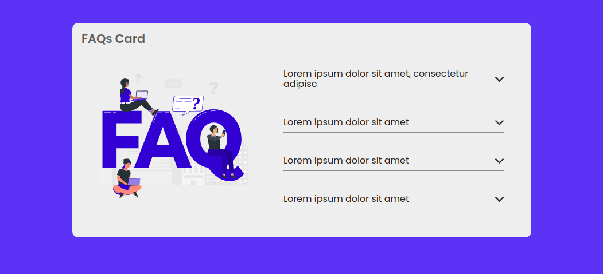

# 🧡 Svelte FAQs Card



## 📕 About

This is a practice project made with Svelte
Since I found it very interesting to learn and that is why I wanted to do this project

## ⚡ Requirements

If you want to clone this repository to add some characteristic or correct something you need these tools to be able to execute it

- NodeJs
- Git
- IDE (some code editor)

## 🌿 Get started

### 🐙 Clone the repository:

```bash
git clone https://github.com/mrLuisFer/svelte-faq-accordion.git

cd svelte-faq-accordion
```

### 📦 Install the dependencies

```bash
npm install
```

Then start with [Rollup](https://rollupjs.org):

```bash
npm run dev
```

Navigate to [localhost:5000](http://localhost:5000)

You should see your app running

### ❄ Building

To create an optimised version of the app:

```bash
npm run build
```

### 📘 Using TypeScript

This template comes with a script to set up a TypeScript development environment, you can run it immediately after cloning the template with:

```bash
node scripts/setupTypeScript.js
```

Or remove the script via:

```bash
rm scripts/setupTypeScript.js
```
